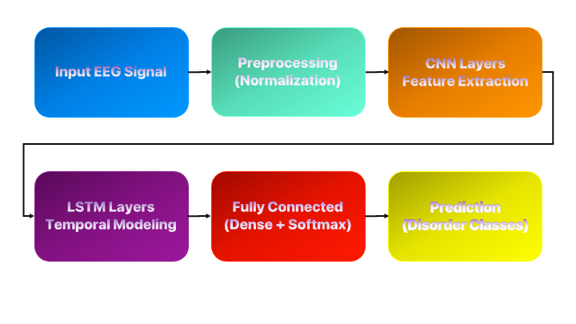
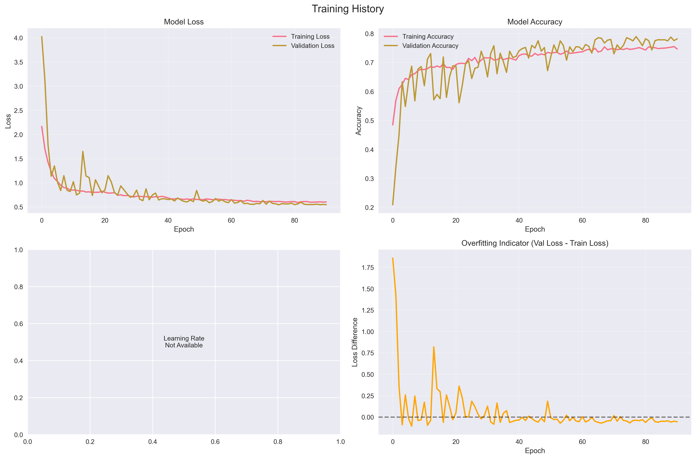
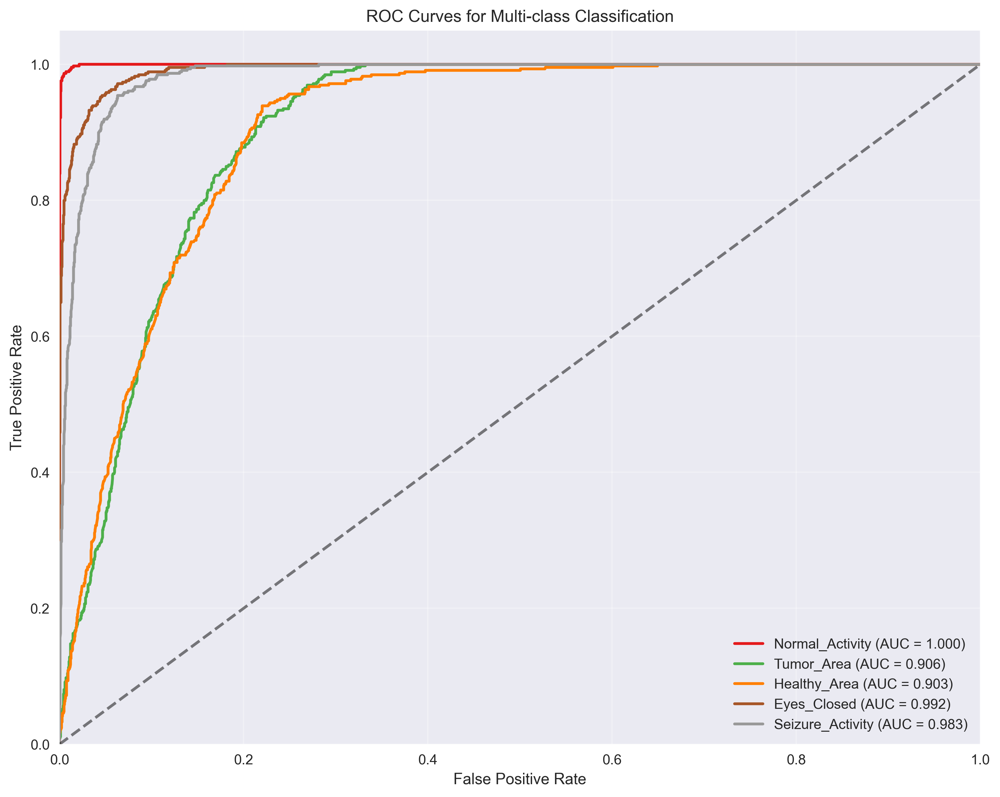
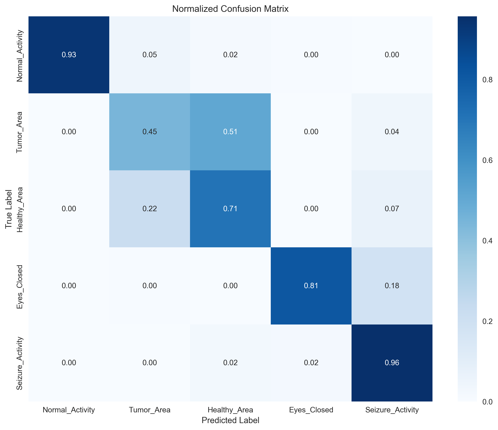
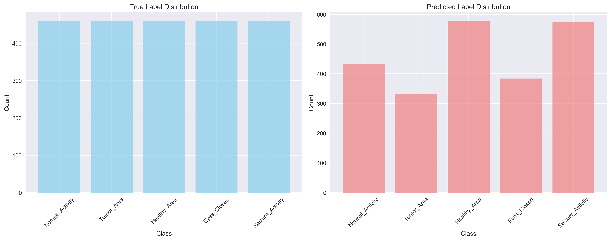
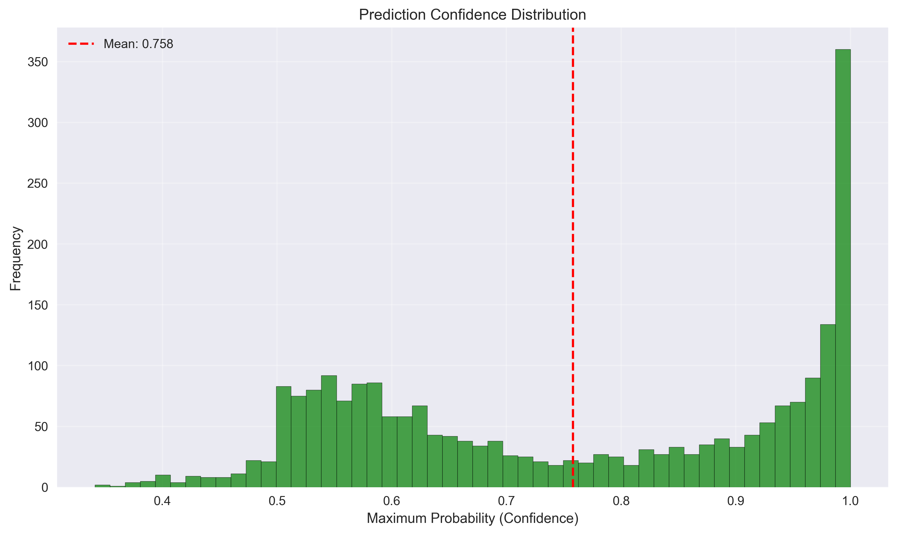

# 🧠 BrainWaveDisorderNet
A deep learning-based system for detecting brainwave disorders (such as epileptic seizures) using EEG signals.


---

## 📌 Overview
**BrainWaveDisorderNet** is designed to classify EEG signals and detect patterns associated with neurological conditions such as **epileptic seizures**, **tumor activity**, and **eye state**. The model leverages a hybrid **CNN + LSTM** architecture to capture both spatial and temporal dependencies in EEG time-series data.

---

## ✨ Features
- ✅ Multi-class EEG disorder classification  
- ✅ **CNN + LSTM** hybrid deep learning model  
- ✅ **Real-time inference** (sliding window)  
- ✅ Visualization tools: ROC curves, confidence distribution, prediction analysis  
- ✅ Detailed evaluation metrics and confusion matrix  

---

## 🏗 Project Structure
BrainWaveDisorderNet/

├── data/ # EEG datasets

├── src/ # Source code

│ ├── models/ # CNN + LSTM architecture

│ ├── preprocessing/ # Data cleaning and normalization

│ ├── training/ # Training scripts

│ └── inference.py # Real-time inference

├── notebooks/ # Jupyter notebooks for experiments

├── assets/ # Images and visualizations

├── requirements.txt # Dependencies

└── README.md # Documentation


---

## 🔍 Architecture
The architecture uses CNN layers for feature extraction and LSTM layers for temporal sequence modeling.

 <!-- Add your architecture diagram here -->

---

## 📦 Installation
Clone the repository and install dependencies:
```bash
git clone https://github.com/Mohammad-Baghery/BrainWaveDisorderNet.git
cd BrainWaveDisorderNet
pip install -r requirements.txt
```
---

## ▶️ Usage
Train the model
```
python src/training/train.py --epochs 50 --batch-size 64 --dataset data/epilepsy.csv
```

Run inference
```
python src/inference.py --input path/to/eeg_data.csv
```
---

## 📂 Dataset
This project uses the [Epileptic Seizure Recognition Dataset.](https://www.kaggle.com/datasets/harunshimanto/epileptic-seizure-recognition)

---

## 📊 Results
Overall Metrics


| Metric | Value |
| ------- | ------ |
| Test Loss | 0.5361
| Accuracy | 77.13% |
|Macro Avg F1 | 0.7691 |
|    ROC-AUC (Macro)    |  0.9569     |


---
Class-wise ROC-AUC

| Class | ROC-AUC |
| ----- | ----------- |
|   Normal Activity    |    0.9997     |
|   Tumor Area    |   0.9056      |
|     Healthy Area  |     0.9033    |
|      Eyes Closed |     0.9924   |
|   Seizure Activity     |   0.9834      |

---
Classification Report

| Status           | Precision | Recall | F1 |
|------------------| --- | --- | --- |
| Normal Activity  | 0.9954 | 0.9348 | 0.9641 |
| Tumor Area       |       0.6205    |   0.4478     | 0.5202   |
| Healthy Area     |     0.5623      |   0.7065     |  0.6262  |
| Eyes Closed      |     0.9714      |     0.8109   | 0.8839   |
| Seizure Activity |      0.7666     |    0.9565    |  0.8511  |

---

## 👀 Visualizations
Visualizations


ROC Curves


Confusion Matrix


Prediction Distribution


Confidence Distribution


---

## ✅ TODO
 - Deploy with FastAPI + Docker
 - Add Grad-CAM for model interpretability
-  Optimize model for real-time EEG streaming

---

## 👨‍💻 Author
Mohammad Baghery
- [GitHub](https://github.com/Mohammad-Baghery/BrainWaveDisorderNet)
- [LinkedIn](https://www.linkedin.com/in/mohammad-baghery/)